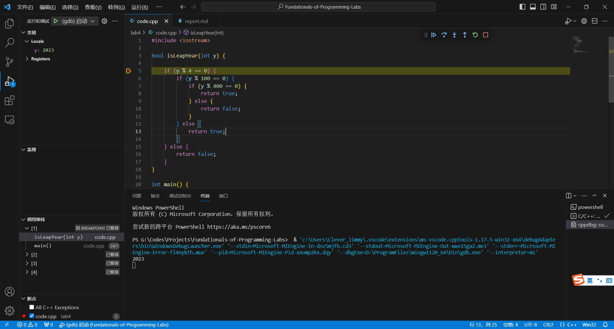
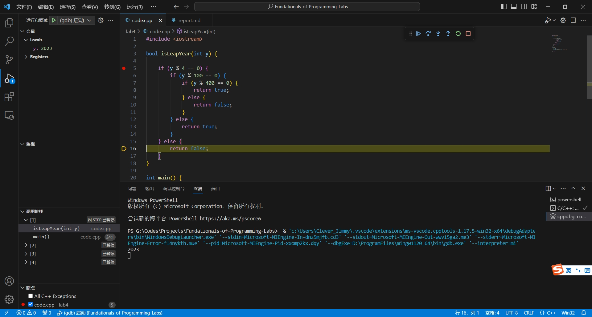
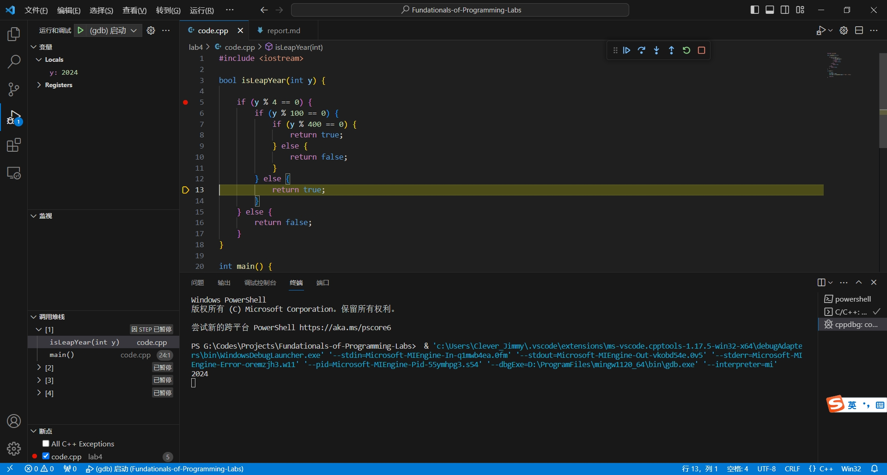
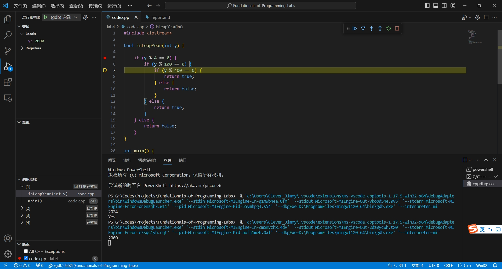
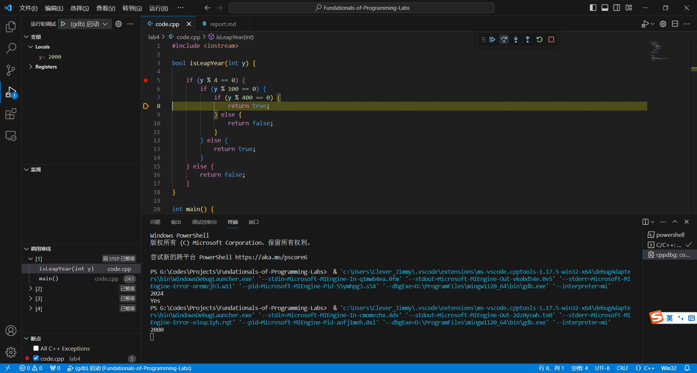
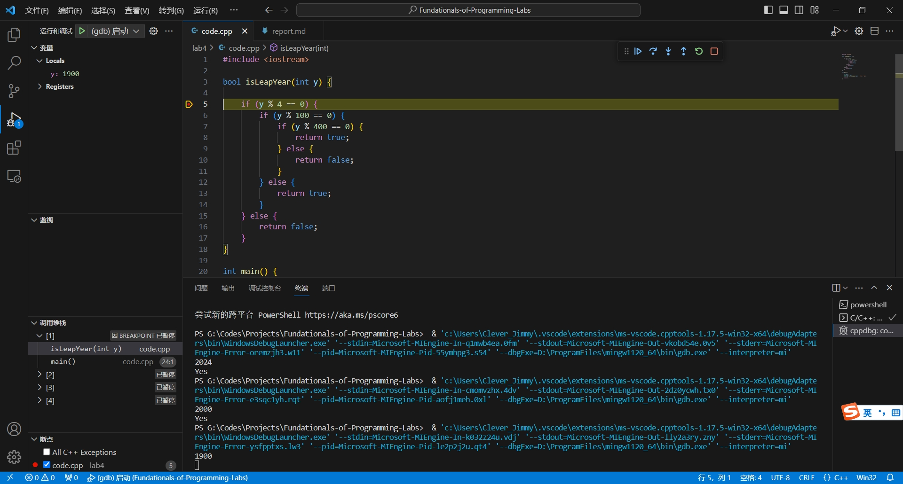

## 上机实验四

熊泽恩 计24 2022011223

### 代码实现

```cpp
#include <iostream>

bool isLeapYear(int y) {

    if (y % 4 == 0) {
        if (y % 100 == 0) {
            if (y % 400 == 0) {
                return true;
            } else {
                return false;
            }
        } else {
            return true;
        }
    } else {
        return false;
    }
}

int main() {

    int year;
    std::cin >> year;
    std::cout << (isLeapYear(year) ? "Yes" : "No");

    return 0;
}
```

### 测试数据与截图

#### 测试数据 1：2023





#### 测试数据 2：2024




#### 测试数据 3：2000






#### 测试数据 4：1900




### 选做任务：实现更多的闰年判断方法

将原始代码中的 `isLeapYear()` 的实现替换如下：

#### 方法 1

```cpp
bool isLeapYear() {
    if ((year % 4 == 0 && year % 100 != 0) || (year % 400 == 0))
        return true;
    else
        return false;
}
```

#### 方法 2

```cpp
bool isLeapYear() {
    return (year % 4 == 0 && year % 100 != 0) || (year % 400 == 0);
}
```
