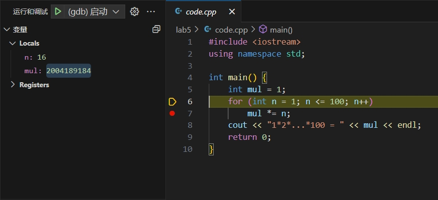
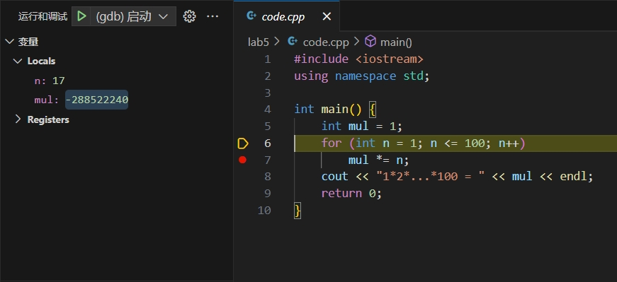

## 上机实验五

### 单步跟踪





### 输出二进制 bit 串

#### 代码实现

```cpp
#include <bits/stdc++.h>

std::string print(int x) {
    std::stack<bool> stk;
    std::string res;
    for (int i = 0; i <= 31; i++)
        stk.push(x >> i & 1);
    while (!stk.empty()) {
        res.push_back(stk.top() + '0');
        stk.pop();
    }
    return res;
}

int main() {
    int mul = 1;
    for (int n = 1; n <= 100; n++) {
        mul *= n;
        printf("*%3d, mul = %11d, bin = %s\n", n, mul, print(mul).c_str());
    }
    return 0;
}
```

得到的部分输出如下：

```
* 10, mul =     3628800, bin = 00000000001101110101111100000000
* 11, mul =    39916800, bin = 00000010011000010001010100000000
* 12, mul =   479001600, bin = 00011100100011001111110000000000
* 13, mul =  1932053504, bin = 01110011001010001100110000000000
* 14, mul =  1278945280, bin = 01001100001110110010100000000000
* 15, mul =  2004310016, bin = 01110111011101110101100000000000
* 16, mul =  2004189184, bin = 01110111011101011000000000000000
* 17, mul =  -288522240, bin = 11101110110011011000000000000000
```

#### 思考原因

**补码表示法**

`int` 类型只有 $32$ 位，在补码表示法下，最高位（第 $32$ 位）表示 $-2^{31}$；其余各位中，第 $i$ 位表示 $2^{i-1}$。这样，一个 `int` 类型的数可以表示 $[-2^{31}, 2^{31} - 1]$ 共 $2^{32}$ 个数。

因此我们可以推断出，当第 $32$ 为 $1$ 的时候，该 `int` 类型的数为负数；为 $0$ 时该数为非负数。

**中间出错：$n = 13$ 时已经溢出**

在我们进行乘法运算的时候，实际上在 $n = 13$ 时已经发生了溢出。

```
* 10, mul =     3628800, bin = 00000000001101110101111100000000
* 11, mul =    39916800, bin = 00000010011000010001010100000000
* 12, mul =   479001600, bin = 00011100100011001111110000000000
* 13, mul =  1932053504, bin = 01110011001010001100110000000000
```
此时 $12! = 479001600$ 仍为正确结果，但 $13! \neq 1932053504$。这是由于 $479001600$ 乘 $13$ 得到 $6227020800$ 已经大于 $2^{31} - 1 = 2147483647$。实际上，$6227020800$ 的二进制表示为（方括号内为第 $36$ 至第 $33$ 位）

```
[0001]01110011001010001100110000000000
```

`int` 类型只取该二进制串最后的 $32$ 位作为最终的运算结果，再转化为 `int` 类型就得到了 $1932053504$，而非 $6227020800$。事实上，它们俩的差刚好是方括号内的 $1$ 的结果，即 $2^{32} = 4294967296$。

所以，当 $n \ge 13$ 后的结果均为错误结果。

**最终结果：$n = 17$ 时变为负数**

$n = 16$ 时一个已经被截断过的错误结果为 $2004189184$，将它乘 $17$ 得到 $n = 17$ 时的结果 $34071216128$。它的二进制表示为（方括号内为第 $36$ 至第 $33$ 位）

```
[0111]11101110110011011000000000000000
```

`int` 取最后 $32$ 位得到二进制串 `11101110110011011000000000000000`，由于最高位为 $1$，所以是一个负数。转为 `int` 得到 $-288522240$。

这就是 $n = 17$ 时结果为负数的原因。虽然 $n \ge 13$ 时得到的结果均为错误结果，但当 $n \in [13, 16]$ 时错误结果的二进制表示的最高位均为 $0$，所以不是负数；当 $n = 17$ 时，错误结果的二进制表示的最高位恰巧为 $1$，所以是负数。
